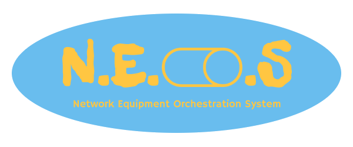
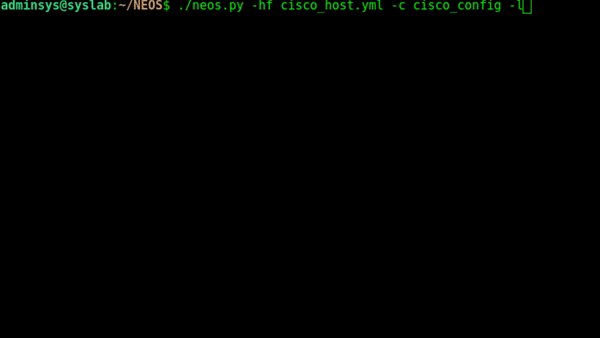

# Introduction

« NEOS » is a free and open source tool to deploy configuration on your network equipments using SSH. The project is multi-vendor and support 
all the vendors that Netmiko provides. Many thank's to Kirk Byers for his amazing library.

### Supports :
###### Regularly tested

    Arista vEOS
    Cisco ASA
    Cisco IOS
    Cisco IOS-XE
    Cisco IOS-XR
    Cisco NX-OS
    Cisco SG300
    HP Comware7
    HP ProCurve
    Juniper Junos
    Linux

###### Limited testing

    Alcatel AOS6/AOS8
    Apresia Systems AEOS
    Calix B6
    Cisco WLC
    Dell OS10
    Dell-Force10
    Dell PowerConnect
    Extreme ERS (Avaya)
    Extreme VSP (Avaya)
    Extreme VDX (Brocade)
    Extreme MLX/NetIron (Brocade/Foundry)
    Huawei
    IP Infusion OcNOS
    Mellanox
    NetApp cDOT
    Palo Alto PAN-OS
    Pluribus
    Ruckus ICX/FastIron
    Ubiquiti EdgeSwitch
    Vyatta VyOS

###### Experimental

    A10
    Accedian
    Aruba
    Ciena SAOS
    Citrix Netscaler
    Cisco Telepresence
    Check Point GAiA
    Coriant
    Dell EMC Isilon
    Eltex
    Enterasys
    Extreme EXOS
    Extreme Wing
    Extreme SLX (Brocade)
    F5 LTM
    Fortinet
    MRV Communications OptiSwitch
    Nokia/Alcatel SR-OS
    QuantaMesh

# Getting started

### 1. Get the code
    git clone https://github.com/cap10mo/NEOS.git
    cd NEOS
### 2. Install requirements
    pip install -r requirements.txt

# Basic usage
    $ ./neos.py --help
    usage: neos.py [-h] --hostfile HOSTFILE --commands COMMANDS [--log] [--normalmode]

    optional arguments:
      -h, --help            show this help message and exit
      --hostfile HOSTFILE, -hf HOSTFILE
                        Hosts file directory
      --commands COMMANDS, -c COMMANDS
                        Commands file
      --log, -l             Save logs
      --normalmode, -nm     Normal mode

# Tutorial

### 1. Create hostfile in YAML format
    ---
    cisco1:
      device_type: cisco_ios
      ip: 10.0.0.1
      username: admin
      password: password
    cisco2:
      device_type: cisco_ios 
      ip: 10.0.0.2
      username: admin
      password: password
    cisco3:
      device_type: cisco_ios
      ip: 10.0.0.3
      username: admin
      password: password

### 2. Create commands file (If you wants to execute commands in "Configuration mode", do not use "-nm" argument)
    vlan 40
    name ADMINISTRATION
    vlan 50
    name STUDENTS
    vlan 60
    name VOIP

### 3. Execute 
    & ./neos.py -hf cisco_host -c cisco_config -v cisco_ios -l

### 4. Check the output

